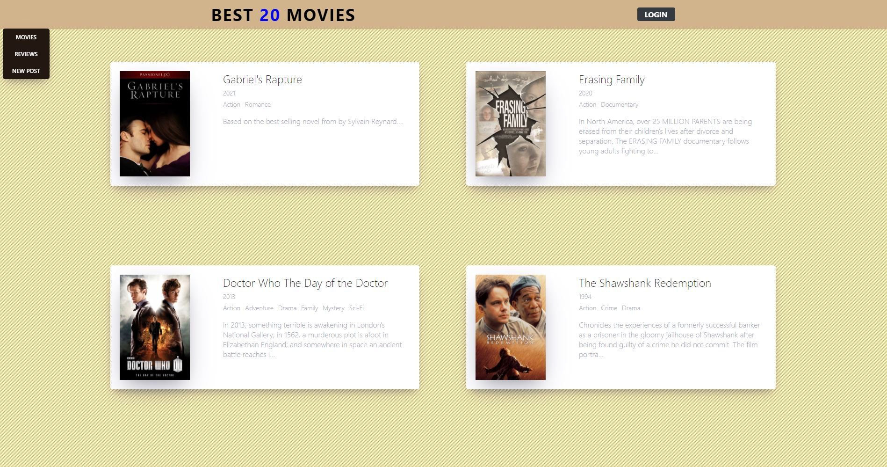

# Movie Information Sharing Website

# Overview

**1. This Online Movie Information Website is for users to *Get movie information* and *create, update*, and *share review* of each movie.**

**2. Project Performing**  
&nbsp; &nbsp; * Database:			        MongoDB (online)  
&nbsp; &nbsp; * Server Environment: 		Node.js  
&nbsp; &nbsp; * Server Side Framework: 	    Koa  
&nbsp; &nbsp; * Client Side Framework: 	    React  
&nbsp; &nbsp; * React State Management:     Redux  
&nbsp; &nbsp; * Middleware(Asynchronous):   redux-saga  
&nbsp; &nbsp; * Component Styling:     		styled-components  
&nbsp; &nbsp; * Membership Authentication:  JSON Web Token  
&nbsp; &nbsp; * Online Hosting: 			Heroku  

